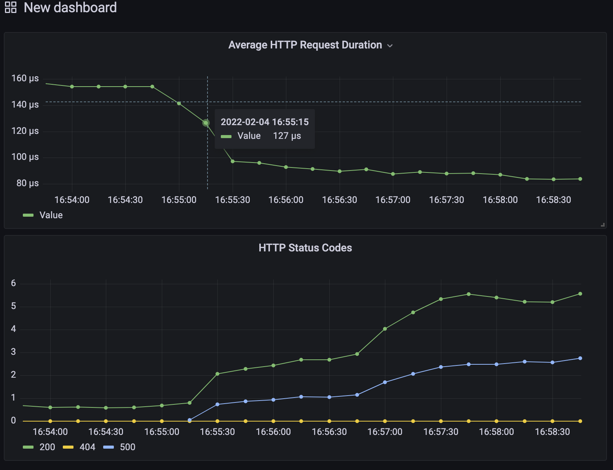

# SRE Instrumentation Challenge

Your goal is to add Prometheus instrumentation to our in-memory Storage API which is written in Python (see `src/README.md` for more details).

**Please invest no more than 5 to 8 hours.** If you cannot complete the task in this time frame, document where you got stuck so we can use this as a basis for discussion for your next interview.

## Your mission, should you choose to accept it:

### Step 1

- Add the Prometheus metrics endpoint to the Storage API
- Expose HTTP request duration in seconds by path, method and status code
- Create a Dockerfile for the Storage API. The Prometheus Server expects it to run on `http://storage_api:5000`.
- Add the newly dockerized Storage API to our docker-compose setup

### Step 2

1. Run `docker-compose up`
2. Create a new Grafana dashboard here: http://localhost:3000
3. The dashboard should contain two graphs for our Storage API:

- Average HTTP Request Duration
- HTTP Status Codes

It should look something like this:

Tip: Run `scripts/generate_traffic.sh` to generate some traffic to the Storage API . The script expects the Storage API to run on http://localhost:5000.

4. Try to figure out why you see HTTP 500 errors for some endpoints

## Evaluation criteria

What we're looking for:

- We expect the resulting Storage API to be equally simple. Even if you don't know Python, the Flask and Prometheus documentation should provide enough guidance
- The Dockerfile and your changes to docker-compose.yml are sensible and concise. You can talk about the pros and cons of your setup in relation to convenience vs security.
- It works reliably. `docker-compose up` and your documentation should be all that is required to review your solution
- Scratch features when necessary, time is short!
- Document your approach, your decisions, and your general notes
